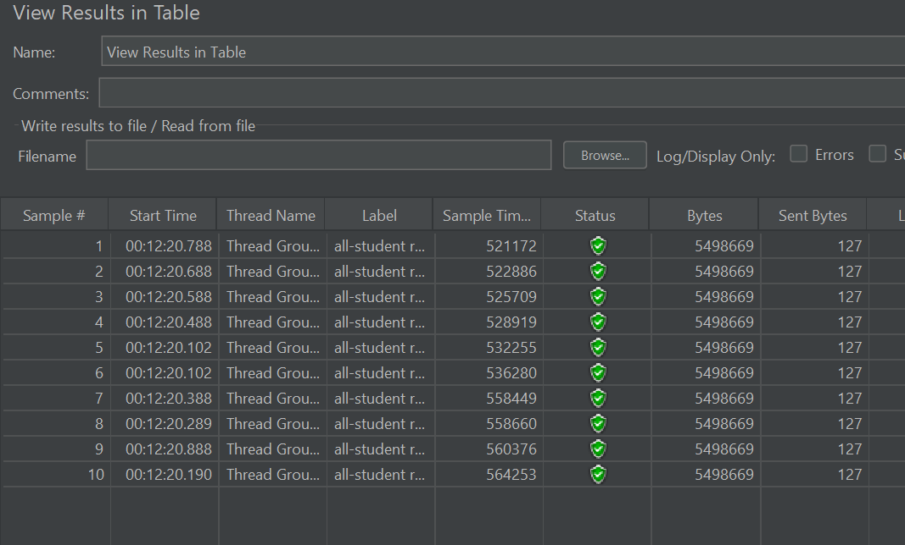
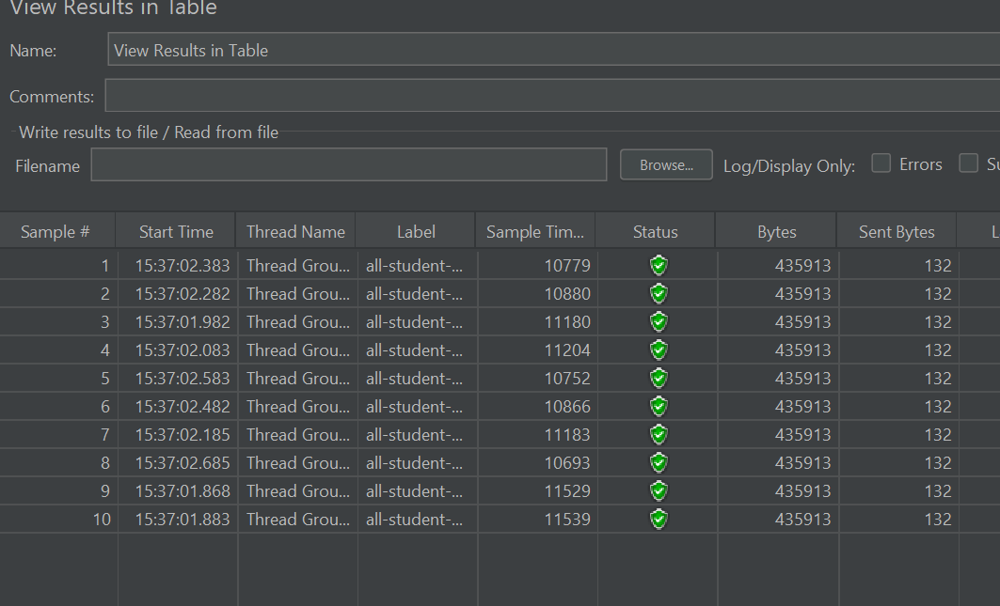
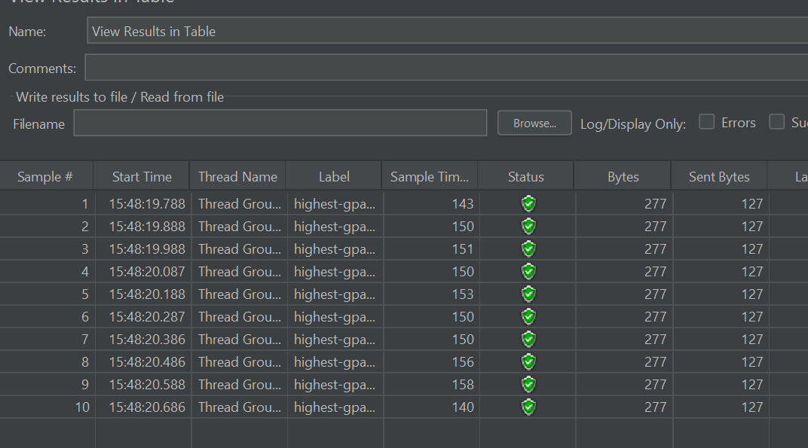
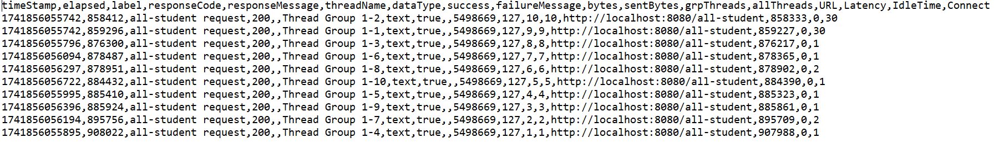
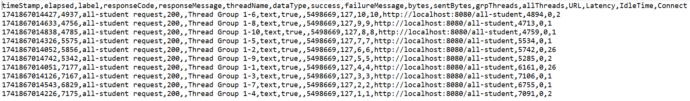
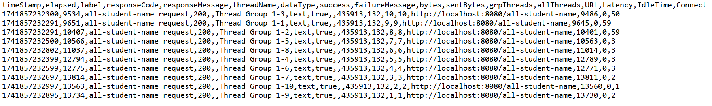
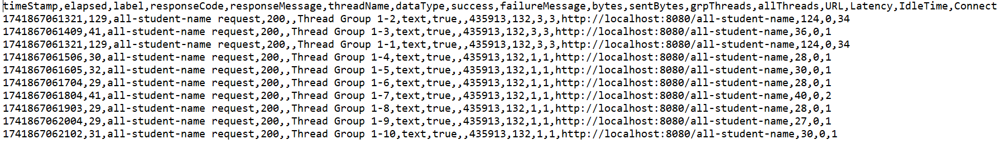
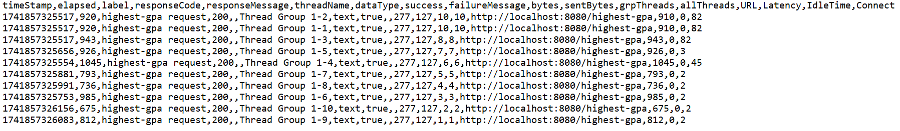
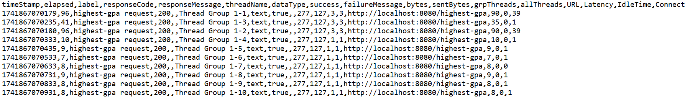

# Tutorial Modul 5 Pemrograman Lanjut
### Nama   : Rayhan Syahdira Putra
### NPM    : 2306275903

## Performance Testing

  
GUI Table Test Results - /all-student

  

  
GUI Table Test Results - /all-student-name

  

  
GUI Table Test Results - /highest-gpa

  

  
CLI Test Results - /all-student

  

  
CLI Test Results - /all-student (Optimized)

  

  
CLI Test Results - /all-student-name

  

  
CLI Test Results - /all-student-name (Optimized)

  

  
CLI Test Results - /highest-gpa

  

  
CLI Test Results - /highest-gpa (Optimized)

  

---

## Reflection

 
  
What is the difference between the approach of performance testing with JMeter and profiling with IntelliJ Profiler in the context of optimizing application performance?

  Pengujian performa dengan JMeter mensimulasikan beban pengguna dan mengukur waktu respons API atau halaman web, sedangkan IntelliJ Profiler fokus pada analisis tingkat kode untuk mengidentifikasi penggunaan CPU, memori, dan metode yang paling membebani sistem. Kombinasi keduanya memberikan optimasi performa dari sisi arsitektur dan implementasi kode.

 
  
How does the profiling process help you in identifying and understanding the weak points in your application?

  Profiling menunjukkan bagian kode mana yang paling banyak menggunakan resource, seperti metode yang memakan CPU tinggi atau terlalu banyak alokasi memori. Dengan data dari call tree, hot spots, dan thread analysis, pengembang dapat menemukan titik lemah yang perlu dioptimalkan.

 
  
Do you think IntelliJ Profiler is effective in assisting you to analyze and identify bottlenecks in your application code?

  Ya, IntelliJ Profiler sangat efektif karena memberikan data real-time tentang jalur eksekusi kode, penggunaan CPU, dan alokasi memori. Dengan alat ini, pengembang bisa langsung menemukan bagian kode yang menyebabkan latensi atau konsumsi resource berlebihan.

 
  
What are the main challenges you face when conducting performance testing and profiling, and how do you overcome these challenges?

  Tantangan utama adalah memastikan hasil pengukuran akurat dan menghindari kesalahan interpretasi data. Solusinya adalah melakukan pengujian berulang dengan skenario yang konsisten, menggunakan dataset yang cukup, serta memadukan alat analisis seperti JMeter dan IntelliJ Profiler.

 
  
What are the main benefits you gain from using IntelliJ Profiler for profiling your application code?

  IntelliJ Profiler memberikan wawasan mendalam mengenai konsumsi CPU, alokasi memori, dan jalur eksekusi kode, sehingga pengembang dapat dengan cepat menemukan dan mengoptimalkan metode yang paling membebani sistem tanpa harus melakukan debugging manual.

 
  
How do you handle situations where the results from profiling with IntelliJ Profiler are not entirely consistent with findings from performance testing using JMeter?

  Jika hasil dari IntelliJ Profiler tidak sesuai dengan temuan dari JMeter, periksa faktor seperti perbedaan beban, jumlah request, atau konfigurasi caching. Pastikan skenario pengujian seragam untuk mendapatkan hasil yang lebih akurat.

 
  
What strategies do you implement in optimizing application code after analyzing results from performance testing and profiling? How do you ensure the changes you make do not affect the application's functionality?

  Optimasi dilakukan dengan mengurangi operasi berlebihan, mempercepat query database, serta menerapkan caching atau parallel processing jika diperlukan. Untuk memastikan perubahan tidak merusak fungsionalitas, dilakukan regresi testing dan validasi dengan dataset nyata.

